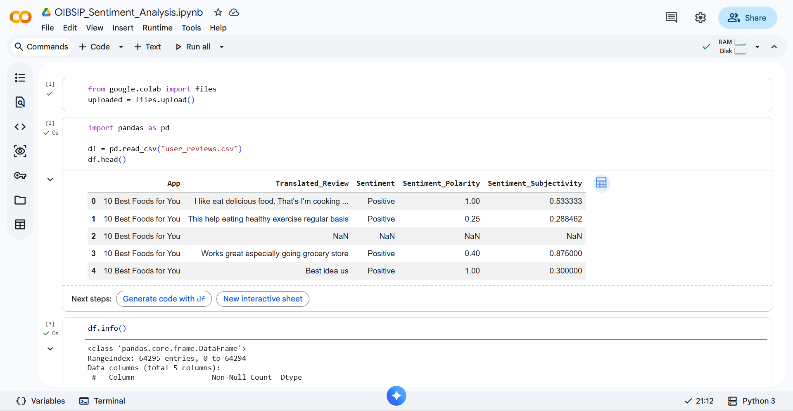
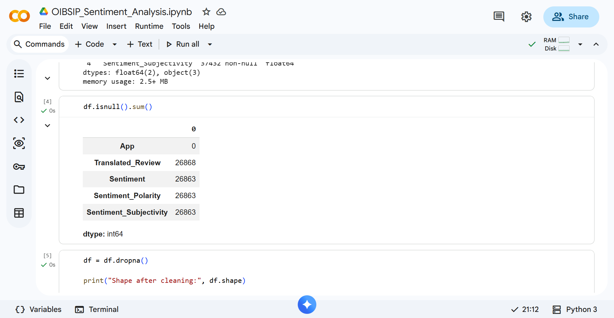
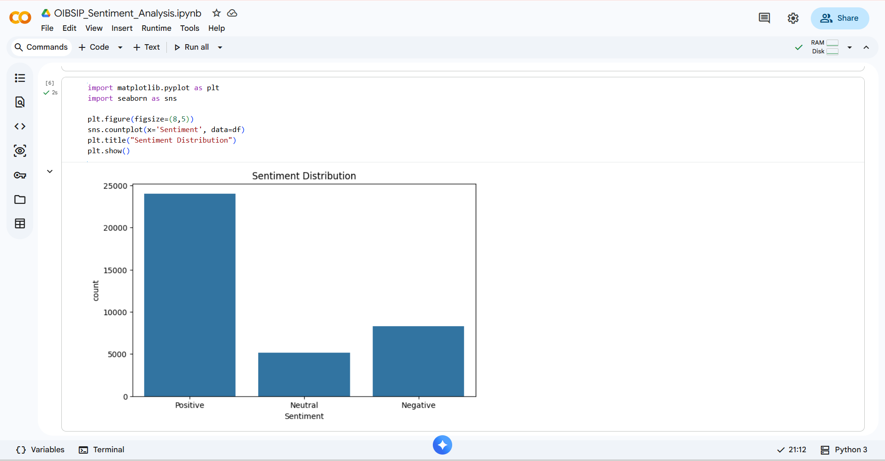
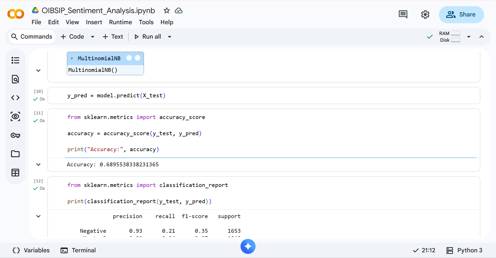
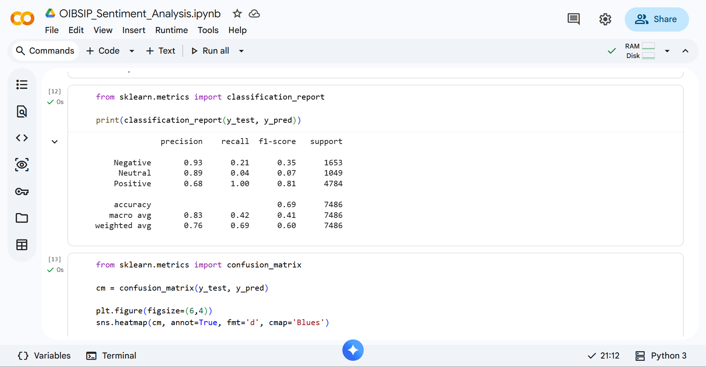
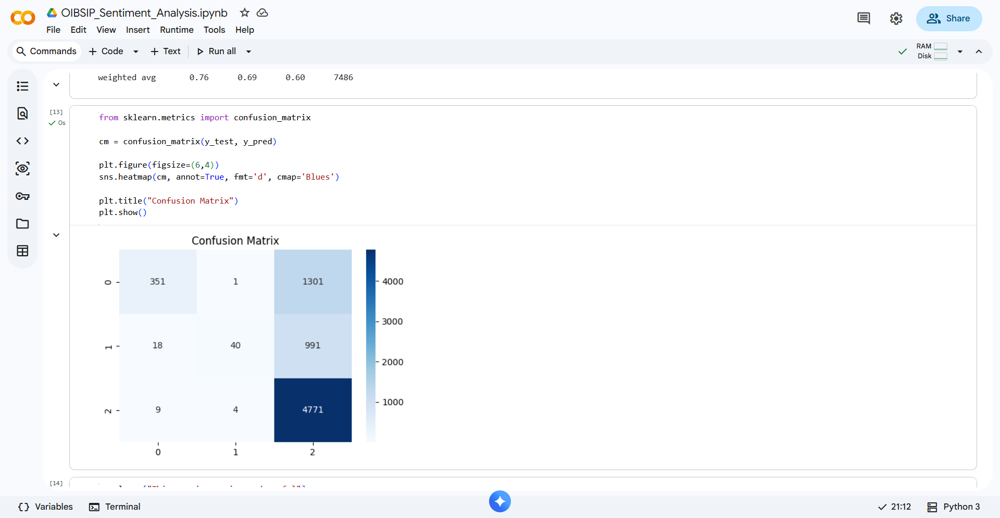
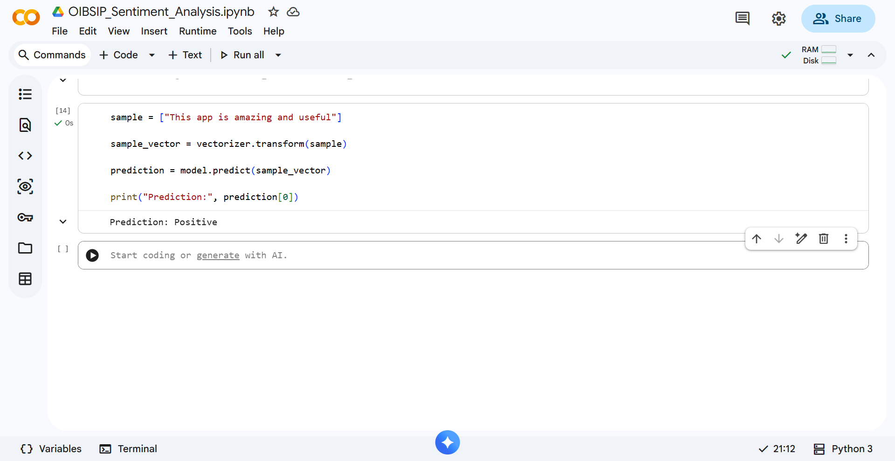

# 📊 OIBSIP - Sentiment Analysis of Google Play Store User Reviews

## 📌 Project Overview

This project was completed as part of the **Oasis Infobyte Data Analytics Internship (OIBSIP)**.

The objective of this project is to perform **Sentiment Analysis** on Google Play Store user reviews using **Natural Language Processing (NLP)** and **Machine Learning** techniques. The model classifies reviews into:

- Positive 😊
- Negative 😞
- Neutral 😐

---

## 🎯 Objective

To analyze user reviews from the Google Play Store and build a machine learning model capable of predicting the sentiment of a review based on its text.

---

## 📂 Dataset

**Dataset:** Google Play Store User Reviews Dataset

### Dataset Features

| Column | Description |
|----------|-------------|
| App | Application Name |
| Translated_Review | User Review Text |
| Sentiment | Positive / Negative / Neutral |
| Sentiment_Polarity | Sentiment Score |
| Sentiment_Subjectivity | Subjectivity Score |

---

## 🛠️ Technologies Used

- Python
- Pandas
- NumPy
- Matplotlib
- Seaborn
- Scikit-Learn
- TF-IDF Vectorization
- Natural Language Processing (NLP)

---

## 🔄 Project Workflow

### 1. Data Loading
- Imported dataset using Pandas.

### 2. Data Cleaning
- Checked missing values.
- Removed null records.

### 3. Exploratory Data Analysis
- Analyzed sentiment distribution.
- Visualized review sentiments.

### 4. Text Preprocessing
- Converted text data into numerical format using TF-IDF Vectorization.

### 5. Model Building
- Split dataset into training and testing sets.
- Trained a Multinomial Naive Bayes classifier.

### 6. Model Evaluation
- Calculated Accuracy Score.
- Generated Classification Report.
- Generated Confusion Matrix.

### 7. Sentiment Prediction
- Predicted sentiment for custom user reviews.

---

## 📈 Results

### Model Used
**Multinomial Naive Bayes**

### Accuracy Achieved
**68.96%**

### Performance Metrics
- Accuracy Score
- Precision
- Recall
- F1-Score
- Confusion Matrix

---

## 📷 Project Screenshots

### Dataset Preview


### Dataset Information


### Missing Values


### Sentiment Distribution


### Accuracy


### Classification Report


### Confusion Matrix


### Custom Prediction


---

## 💡 Sample Prediction

Input Review:

```text
This app is amazing and useful
```

Output:

```text
Positive
```

---

## 📌 Conclusion

The project successfully classified Google Play Store user reviews into Positive, Negative, and Neutral sentiments using Machine Learning and NLP techniques.

This project helped in understanding:

- Text Analytics
- Natural Language Processing
- Feature Extraction using TF-IDF
- Machine Learning Model Training
- Model Evaluation Techniques

---

## 👩‍💻 Author

**Kapa Sri Lakshmi**

B.Tech CSE | Mohan Babu University

Data Analytics Intern @ Oasis Infobyte

GitHub: https://github.com/kapasrilakshmi075
